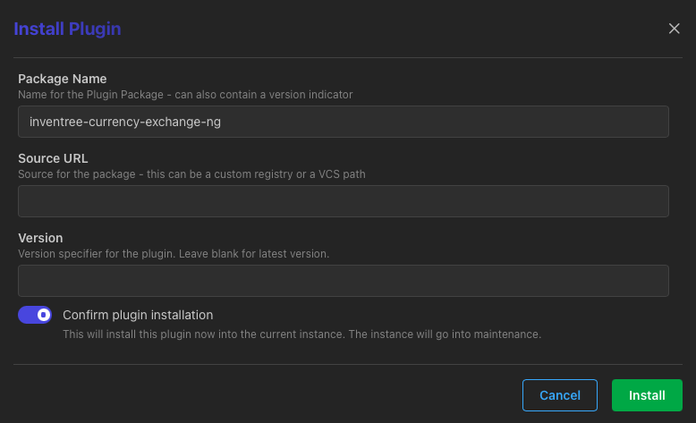

# InvenTreeCurrencyExchangeNG

Currency exchange integration for [InvenTree](https://inventree.org/).
The exchange rates fetches from a free exchange rates API [frankfurter.dev](https://frankfurter.dev).

It is possible to choose a provider, which provides a much more accurate currency exchange rate for the desired region.

## Installation

### InvenTree Plugin Manager

The simplest way to install this plugin is from the InvenTree plugin interface. Enter the plugin name `inventree-currency-exchange-ng` and click the `Install` button:



To apply the changes, server and workers must be restarted.

### Command Line 

To install manually via the command line, run the following command:
 
```bash
pip install inventree-currency-exchange-ng
```

Or, add to your `plugins.txt` file to install automatically using the `invoke install` command:

```
inventree-currency-exchange-ng
```

Now open your InvenTree's "Admin Center > Plugins" page to activate the plugin.

## Configuration

Open "System Settings > Pricing" and update `Default Currency` and `Supported Currencies` which correspond to your economic activity.

Then go to "Admin Center > Plugins", open "Plugin Detail" of `InvenTreeCurrencyExchangeNG` and select `Central banks or official institutions` from drop down list which corresponds to your region.

Next, open "Admin Center > Currencies" to setup plugin.
Make sure that the `Default Currency` is selected correctly.
Change `Currency Update Plugin` to `InvenTree Currency Exchange NG`.

Hit the "🔄" icon to refresh currency exchange rates.
